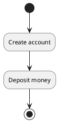
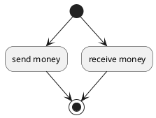
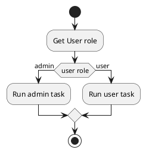
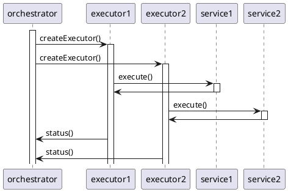

# ZaloPay Flow

## 1. Bài toán
Mục đích là để có 1 layer thực hiện việc quản lý, thực thi các flow nghiệp vụ, mỗi Flow nghiệp vụ involve đến nhiều services nằm ở các host khác nhau. 

Yêu cầu của bài toán là phải thực hiện flow theo schema đã định, có thể chạy tuần tự, song song các service, mỗi flow phải đảm bảo tính chất ACID   

Áp dụng mô hình Saga vào các executor.

```
interface ExecutableSaga {
	+Execute()
	+Compensate()
	+Status()
}
```

 FlowStorage
ZaloPay_Flow -> Orchestrator: Execute flow
OSSaga --> OrderSystemService: gRPC
ZASSaga --> AccountSystemService: gRPC
BCSaga --> BCService: gRPC
@enduml
'>

## 2. Các thành phần chính

### 2.1 Parser
Nhiệm vụ Parse input JSON từ API request. Có 2 tác vụ Parser phải làm:

#### Task definition
Task đại diện cho 1 function, với endpoint là service, task có thể gọi tới gRPC của 1 service, hoặc gọi tới 1 flow khác (TBD)
```
{
    "name": "create-account-task",
    "service": "ZAS",
    "entryPoint": "createAccount",
    "parameters": {
        "userId": "string",
        "userBalance": "int"
    },
    "retryCount": 3,
    "timeout": 1200
}
```

#### Flow Definition
Flow là danh sách các task sẽ được chạy, truyền vào parameter cụ thể, chạy theo tuần tự hoặc parallel.

Ở cuối mỗi task có phần decision để xác định nhánh flow tiếp theo. Những từ khoá được reserved lại là "return", "error", "compensation".

**Sequence và không rẽ nhánh:**



```
{
    "name": "zas-flow-1",
    "type": "flow",
    "description": "create account and deposit money",
    "tasks": [
    {
      "name": "create account",
      "taskReferenceName": "create-account-task",
      "inputParameters": {
        "userId": "quannm4",
        "userBalance": 55000000000
      },
      "decision": {
        "CREATE_OK": "deposit money",
        "CREATE_FAIL": "compensation"
      }
    },
    {
      "name": "deposit money",
      "taskReferenceName": "deposit-money-task",
      "inputParameters": {
        "amount": 500
      },
      "decision": {
        "DEPOSIT_OK": "return",
        "DEPOSIT_FAIL": "compensation"
      }
    }
  ]
}
```

**Parallel và không rẽ nhánh:**


Đối với các task run parallel thì chỉ cần add thêm field `"mode":"parallel"` vào
```
{
    "name": "zas-flow-1",
    "type": "flow",
    "description": "transfer money",
    "tasks": [
    {
      "name": "send money",
      "taskReferenceName": "transfer-money",
      "inputParameters": {
        "from": "quannm4",
        "to": "thinhda",
        "userBalance": 500
      },
      "decision": {
        "TRANSFER_OK": "return",
        "TRANSFER_FAIL": "compensation"
      }
    },
    {
      "name": "receive money",
      "taskReferenceName": "transfer-money",
      "inputParameters": {
        "from": "quannm4",
        "to": "thinhda",
        "userBalance": 500
      },
      "decision": {
        "TRANSFER_OK": "return",
        "TRANSFER_FAIL": "compensation"
      }
    }
  ],
  "mode": "parallel"
}
```

**Sequence và rẽ nhánh:**



```
{
    "name": "zas-flow-99",
    "type": "flow",
    "description": "get role of user then do user task",
    "tasks": [
    {
      "name": "get role",
      "taskReferenceName": "get-role-task",
      "inputParameters": {
        "name": "quannm4",
      },
      "decision": {
        "ADMIN": "do-admin-task",
        "USER": "load-user-data"
      }
    },
    {
      "name": "do admin task",
      "taskReferenceName": "do-admin-task",
      "inputParameters": {
        "userId": "quannm4",
        "lengthOfStay": 2
      },
      "decision": {
        "OK": "return",
        "FAIL": "compensation"
      }
    },
    {
      "name": "load user data",
      "taskReferenceName": "load-user-data",
      "inputParameters": {
        "carManufacturer": "Honda",
        "carModel": "Accord",
        "lengthOfRental": 2
      },
      "decision": {
        "OK": "return",
        "FAIL": "compensation"
      }
    }
  ]
}
```

### 2.2 Orchestrator
- Khi ZaloPay Flow nhận được lệnh chạy flow. Zalopay sẽ tạo 1 orchestrator và các executor ứng với bao nhiêu flow cần chạy.
- Đối với mỗi executor khi trả về kết quả, orchestrator sẽ đánh giá kết quả trả về dựa trên field "decision" của workflow, để xác định flow đã thành công hay thất bại. Nếu thành công thì kết thúc flow, nếu thất bại thì xác định rollback lại từ bước trước đó.
- Metadata của flow khi chạy sẽ được store vào trong DB.
- Mỗi khi chuyển trạng thái, Orchestrator sẽ lưu lại trạng thái trước đó để khi có error, thì orchestrator cũng sẽ biết được trạng thái trước đó là gì và thực hiện compensation.

### 2.3 Executor
- Các Executor là các actor theo Actor model, nhận message từ Orchestrator, và chạy async.
- Cac Sagas chạy theo mô hình saga, tức phải có compensation step nếu fail.

### 2.4 Đối với nghiệp vụ đòi hỏi kiểm tra kết quả và pass kết quả sang 1 task khác
*TBD*
## 3. Implementation:
Framework: Spring Boot + Akka

Sử dụng Akka:
- Phù hợp với flow and stream. Có thể chạy song song/ pipeline.
- Chạy sync/async
- Message driven

### 3.1 ZaloPay Flow Gateway
- Spring boot (JSON parser)
- gRPC service
- MySQL

### 3.2 Orchestrator
- Akka System
- Byteman inject (TBD)

```
public interface Orchestrator {
  void createAkkaSystem()
  void status()
  void runFlow() 
}
```



### 3.3 Executor
- Akka actor
- gRPC client
```
public interface Executor {
  void createAkkaActor()
  void status()
  void execute() 
}
```

## 4. Data Schema
Database for Task and Flow storage: MongoDB. Since Spring Boot has a very good intense support for MongoDB.
### 4.1 Task

### 4.2 Flow
Flow table:
